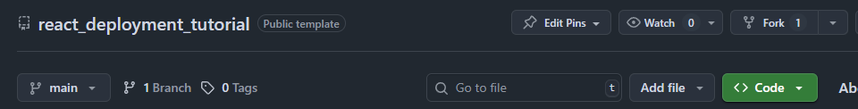
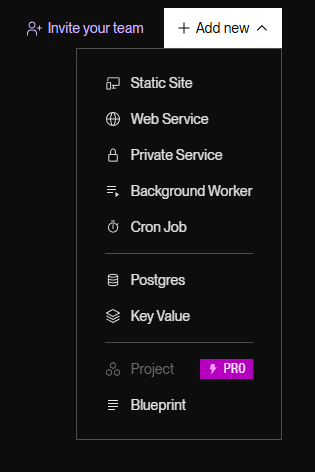
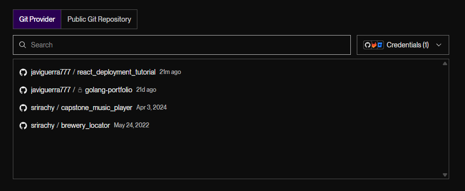
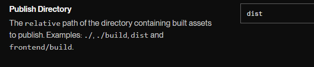
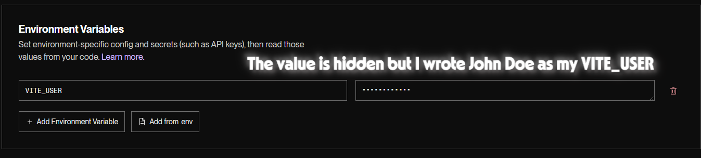
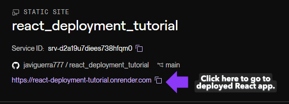
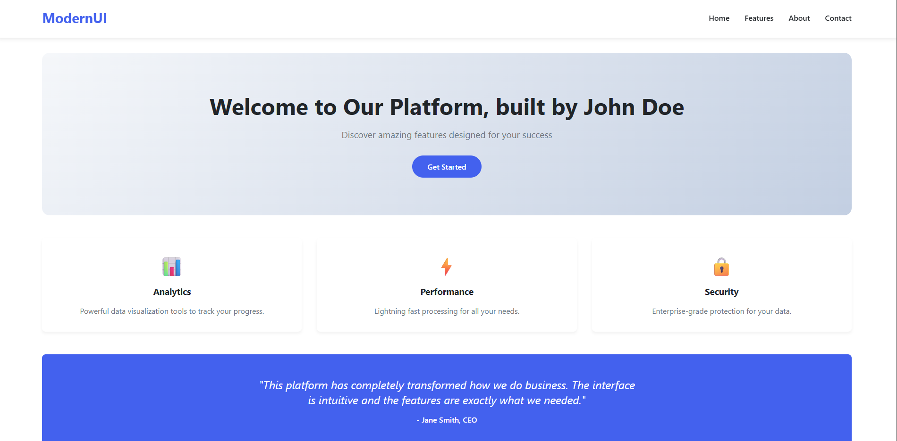

# NPower React Deployment to Render Tutorial
This repository has a React Frontend Built, there is no real functionality only a User Interface built. The purpose of this repository is to teach you how to deploy a React application to the [Render Platform](https://render.com/)

## Prerequisites
You must have the following below to complete this lesson
- A Render account, if you do not have an account go to [Render's Website](https://render.com) to create an account to deploy your code.

## Installing Project
In this tutorial all you will need to do is FORK the repository to your GitHub, you DO NOT need to clone and run any code unless you want to.

1. Please make sure to fork this repository to your personal GitHub. You will find the button to fork this repository near the top right part of the screen

Press this button and on the next screen it will give you the option to fork the repository make sure to click the green button title "Create fork" to fork the repositoy to your own GitHub

## Deploying to Render

1. After you fork the repository navigate to [Render Dashboard](https://dashboard.render.com/) and click on the button titled "+ Add new", this will open a dropdown, in the dropdown select the option titled "Static Site".

2. On this new screen it will ask you to connect a GitHub Repository, so please make sure to connect the GitHub repository here and select it in the dropdown menu.

3. After you select the GitHub repository you want to deploy you will need to edit the "Publish Directory", in that text input write `dist`.

4. The last thing you need to configure to deploy this project is in the "Environment Variables" section, for the "NAME_OF_VARIABLE" enter `VITE_USER` and for the "Value" write your name, EX: "John Doe"

After you configure the "Publish Directory" and "Environment Variables" click on the button that says "Deploy Static Site". Give the deployment a few minutes to deploy, it should successfully deploy your project, the link of the deployed site will be highlighted purple. Below is an example of what you should be looking for

## Expected Output

Below is an image of what your expected output should look like if you deployed it correctly. The only difference you should see if you entered a name different than "John Doe"

